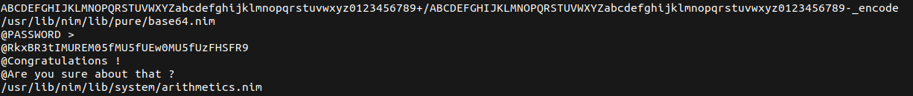
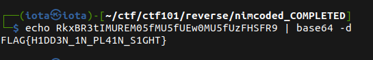

# Nimcoded

* Using `Strings` command on the binary, and scrolling down reading the output of it, i found what it seems like an encoded or encrypted passowrd



* I used `base64 -d` to decode the string/password, and i got the flag:

```bash
#!/bin/bash
echo RkxBR3tIMUREM05fMU5fUEw0MU5fUzFHSFR9 | base64 -d 
```



* Flag: `FLAG{H1DD3N_1N_PL41N_S1GHT}`