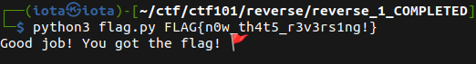

# Reverse 1

## Overview:

* This is a Python program that expects a single command-line argument, which is referred to as the "flag".
* This is a reverse engineering challenge. The code appears to be written in Python and requires a flag as a positional argument.  It checks whether the length of the argument is 26, and if not, it prints "You got the wrong flag buddy" and exits. If the length is correct, it performs a series of checks on various characters in the flag string. Depending on the outcome of these checks, it prints different messages, one of which is "Good job! You got the flag! 🚩".

* Your task is to reverse engineer this program and find the flag.

## Solution

* To solve this challenge, you need to reverse engineer the Python script and find the conditions that the flag needs to satisfy. Then you need to construct a flag that satisfies all those conditions.

> A better and easy way it to start from the print statement at line 66 (`print("Good job! You got the flag! 🚩")`) and then go up condition by condition.

* Let's go, line by line starting from the line 66, and see the flag at each script

1. line 65:

```py
elif flag[20] == 's' and flag[22] == 'n':

# 21th => 's', 23th => 'n'
# flag: ********************s*n***
```

2. line 62:

```py
elif flag[7] == 'w' and flag[17] == 'v':

# 8th => 'w', 18th => 'v'
# flag: *******w*********v**s*n***
```

3. line 58:

```py
elif flag[0xA] == 'h' and flag[21] == str(twenty_first_char):

# twenty_first_char => '1'
# 11th => 'h', 22th => '1'
# flag: *******w**h******v**s1n***

```

4. line 53:

```py
elif eax == eax ^ eax and flag[11] == FUNC_00401000():

# FUNC_00401000() => '4'
# eax == eax ^ eax => eax = 0
# 12th => '4'
# flag: *******w**h4*****v**s1n***

```

5. line 49:

```py
eax = int(flag[6])

# eax => '0'
# 7th => '0'
# flag: ******0w**h4*****v**s1n***

```

6. line 48:

```py
if flag[0xD] == FUNC_00401064() and flag[1] == 'l'.upper() :

# FUNC_00401064() => '5'
# 2nd => 'L', 14th => '5'
# flag: *L****0w**h4*5***v**s1n***

```

7. line 47:

```py
if flag[9] == flag[0xC] == 't' and flag[24] == '!':

# 10th => 't', 13th => 't', 25th => '!'
# flag: *L****0w*th4t5***v**s1n*!*

```

8. line 46:

```py
elif flag[2] == 'A' and flag[3] == 'G':

# 3rd => 'A', 4th => 'G'
# flag: *LAG**0w*th4t5***v**s1n*!*

```

9. line 28:

```py
if flag[8] == chr(0x5F) and flag[5] == 'n' and flag[0xE] == '_':

# 9th => '_', 15th => '_', 6th => 'n'
# flag: *LAG*n0w_th4t5_**v**s1n*!*

```

10. line 26:

```py
elif flag[15] == flag[19] == 'r':

# 16th => 'r', 20th => 'r'
# flag: *LAG*n0w_th4t5_r*v*rs1n*!*

```

11. line 23:

```py
elif flag[16] == flag[18] and flag[18] == chr(0x33):


# 17th => 'r', 19th => '3'
# flag: *LAG*n0w_th4t5_r3v3rs1n*!*

```

12. line 20:

```py
if flag[23] == 'g':

# 24th => 'g'
# flag: *LAG*n0w_th4t5_r3v3rs1ng!*

```

13. line 20:

```py
if flag[0] == 'F':

# 1st => 'F'
# flag: FLAG*n0w_th4t5_r3v3rs1ng!*

```

14. line 18:

```py
elif flag[4] == chr(0x7B) and flag[25] == chr(0x7D):

# 5th => '{', 26th => '}'
# flag: FLAG{n0w_th4t5_r3v3rs1ng!}

```

15. line 13:

```py
if len(flag) !=  26:

# just for sanity check, we can verify the our flag length is 26
# flag: FLAG{n0w_th4t5_r3v3rs1ng!}

```



* Flag: `FLAG{n0w_th4t5_r3v3rs1ng!}`